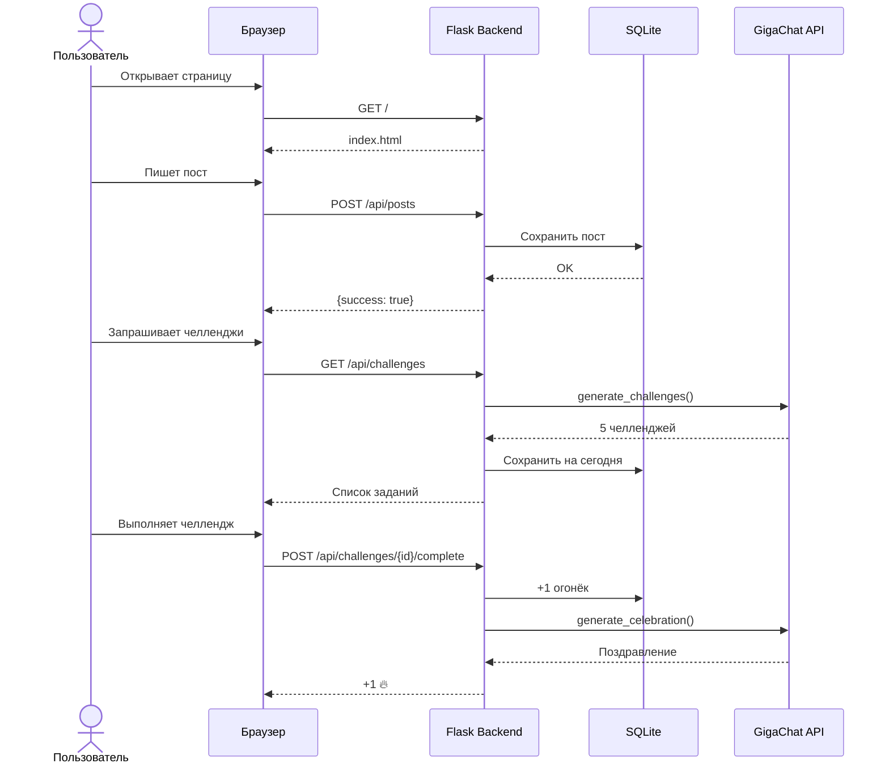

# AI Wellness Quest

**"Худеем на здоровье"** — это фитнес-приложение нового поколения, которое решает главную проблему пользователей: отсутствие долгосрочной мотивации. В отличие от обычных приложений, мы создаем экосистему бережной поддержки, где забота о себе становится радостью, а не обязанностью.

Центральная механика строится вокруг валюты **«огоньки»**. Выполняя простые ежедневные задания (от 500 шагов до полноценной тренировки), пользователь получает огоньки и продвигается по лигам — от Бронзы до Легенды. Социальная лента показывает только пользователей того же уровня, убирая эффект «никогда не догоню». "Худеем на здоровье" не заставляет, а поддерживает, превращая одиночный путь в общее приключение.

**Технически:** Backend — Flask, frontend — HTML/CSS/JS, AI — GigaChat API.

---

## Стек технологий


---

## Оглавление

- [Демо](#демо)
- [Скриншоты](#скриншоты)
- [Архитектура](#архитектура)
- [Sequence-диаграмма](#sequence-диаграмма)
- [Структура проекта](#структура-проекта)
- [API](#api)
- [База данных](#база-данных)
- [Огоньки и лиги](#огоньки-и-лиги)
- [GigaChat интеграция](#gigachat-интеграция)
- [Запуск](#запуск)

---

## Демо

Визуал приложения можно посмотреть [здесь](https://Term1nat000r.github.io/AI-Wellness-Quest/) — откройте в любом браузере.

---

## Скриншоты

### Меню огоньков

После нажатия на огонёк в правом верхнем углу появляется меню с:
- количеством огоньков у пользователя
- текущими заданиями на день
- количеством заморозок, оставшихся в этом месяце


<!-- TODO: добавить скриншоты ленты, рейтинга, чатов -->

---

## Архитектура

### Уровень 1 — Контекст


**Элементы:** Пользователь → AI Wellness Quest → GigaChat API

---

### Уровень 2 — Контейнеры


**Элементы:** Веб-интерфейс (HTML/CSS/JS) | Backend API (Flask) | База данных (SQLite) | AI Генератор (Python) | GigaChat API

---

### Уровень 3 — Компоненты (app.py)


**Элементы:** Лента API | Чаты API | Огоньки API | Челленджи API | Мотивация API | База данных | AI Генератор

---

### Уровень 4 — Код (gigachat.py)


**Элементы:** _get_token() | _chat() | _parse_json() | generate_challenges() | generate_extra_challenge() | generate_motivation() | generate_celebration() | _fallback_* | GigaChat API

---

## Sequence-диаграмма



---

## Структура проекта

```
AI-Wellness-Quest/
├── app.py                  # Flask backend: роуты, API, работа с БД
├── gigachat.py             # Обёртка над GigaChat API: OAuth, генерация
├── database.db             # SQLite база (создаётся при первом запуске)
├── requirements.txt        # Python-зависимости
├── .env                    # Переменные окружения (GIGACHAT_AUTH_KEY)
│
├── templates/              # HTML-шаблоны
│   └── index.html
│
├── static/                 # Frontend-ассеты
│   ├── css/
│   ├── js/
│   └── img/
│
└── docs/                   # Документация и скриншоты
    └── screenshot-flames-menu.png
```

> ⚠️ Приведена ориентировочная структура. Уточни по реальному дереву репозитория.

---

## API

| Метод | Эндпоинт | Описание |
|-------|----------|----------|
| GET | `/api/me` | Текущий пользователь |
| GET | `/api/users` | Все пользователи |
| GET | `/api/feed` | Лента постов |
| POST | `/api/posts` | Создать пост |
| POST | `/api/posts/{id}/like` | Лайк |
| GET | `/api/chats` | Список диалогов |
| GET | `/api/chats/{id}/messages` | История |
| POST | `/api/chats/{id}/messages` | Отправить |
| GET | `/api/ranking` | Рейтинг |
| GET | `/api/challenges` | Челленджи дня |
| POST | `/api/challenges/{id}/complete` | Выполнить |
| POST | `/api/flames/claim-goal` | Забрать огонёк |
| POST | `/api/freeze` | Заморозка |
| GET | `/api/motivation` | Мотивация |

---

## База данных

### Таблицы

| Таблица | Поля |
|---------|------|
| users | id, name, avatar, flames, record_flames, freezes_left, last_active |
| posts | id, user_id, text, tag, likes, comments, created_at |
| messages | id, from_user_id, to_user_id, text, created_at |
| daily_challenges | id, user_id, date, challenge_text, completed, is_extra |
| flame_log | id, user_id, date, flame_type |

---

## Огоньки и лиги

| Диапазон | Лига |
|----------|------|
| 0-20 | Бронза 🥉 |
| 21-60 | Серебро 🥈 |
| 61-120 | Золото 🥇 |
| 121-200 | Платина 💠 |
| 201-350 | Бриллиант 💎 |
| 351-500 | Мастер 🔮 |
| 501+ | Легенда 👑 |

| Действие | Огоньки |
|----------|---------|
| Выполнить челлендж | +1 |
| Выполнить экстра-челлендж | +2 |
| Выполнить цели | +1 |
| Пропуск 1 дня | -1 |
| Пропуск 2+ дней | -3 |

---

## GigaChat интеграция

### Эндпоинты

| Назначение | URL |
|------------|-----|
| Авторизация | `https://ngw.devices.sberbank.ru:9443/api/v2/oauth` |
| Генерация | `https://gigachat.devices.sberbank.ru/api/v1/chat/completions` |

### Функции gigachat.py

| Функция | Назначение |
|---------|------------|
| `_get_token()` | OAuth, кэш токена |
| `_chat()` | Базовый запрос |
| `_parse_json()` | Извлечение JSON |
| `generate_challenges()` | 5 челленджей |
| `generate_extra_challenge()` | Экстра-челлендж |
| `generate_motivation()` | Приветствие + фраза |
| `generate_celebration()` | Поздравление |
| `_fallback_*` | Запасные данные |

---

## Запуск

### Требования

- Python 3.10+
- Ключ авторизации GigaChat API ([получить здесь](https://developers.sber.ru/portal/products/gigachat-api))

### Установка

**1. Клонировать репозиторий**

```bash
git clone https://github.com/Term1nat000r/AI-Wellness-Quest.git
cd AI-Wellness-Quest
```

**2. Создать виртуальное окружение**

```bash
python -m venv venv

# Linux / macOS
source venv/bin/activate

# Windows
venv\Scripts\activate
```

**3. Установить зависимости**

```bash
pip install -r requirements.txt
```

Если `requirements.txt` ещё нет:

```bash
pip install flask requests python-dotenv
```

**4. Настроить переменные окружения**

Создай файл `.env` в корне проекта:

```env
GIGACHAT_AUTH_KEY=your_auth_key_here
```

**5. Запустить приложение**

```bash
python app.py
```

Приложение будет доступно по адресу `http://localhost:5000`.
